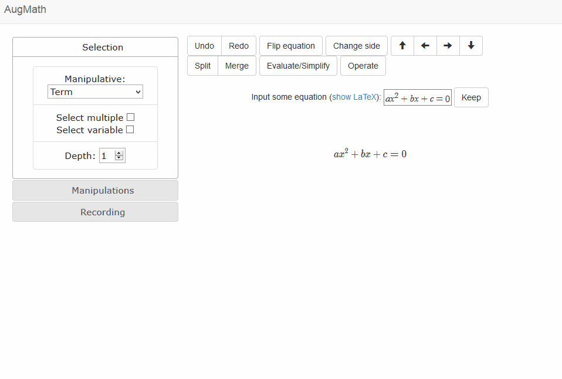
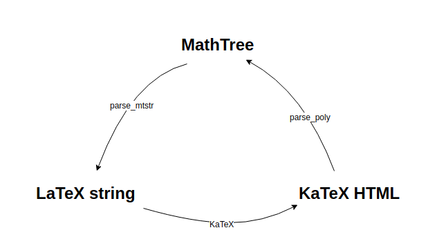

# AugMath

<!--  -->

Try it live [here](http://augmath.xyz)

## Vision

See [here](http://guillefix.me/augmath.html).
Some video demos can be seen [here](https://youtu.be/LyQkDemP67A?t=3m44s) and [here](https://www.youtube.com/watch?v=9fwOiLsuXSI&feature=youtu.be)

## Usage
Here's a quick demo of most of the current manipulations:
 

 (Created using [ScreenToGif](https://screentogif.codeplex.com/))

## Development

1. Install [MeteorJS](https://www.meteor.com/)

2. Run `npm install` to intall rest of dependencies

3. Install [webpack](https://webpack.js.org/) and [webpack-dev-server](https://github.com/webpack/webpack-dev-server) for trying the bundled version (work in progress).

You can now bundle augmath into a standalone JS file and use it in your own projects through a simple API!

To use: Run `npm run webpack`, get the `bundle/augmath.js` file, and see `client/library.jsx` and `index.html` for example of how to use it on your own html files.

### File structure

Following standard Meteor structure.

The entrypoint files for the client app (where most of the action happens right now) are in the `client` folder. Some assets are found in `public`. For the server side part, they are in the `server` folder.

The `client/main.jsx` file basically just imports everything it needs, from the main codebase, found in `imports`. The file containing the main structure and layout of the web app is `imports/ui/App.js`. We are using the awesome [React](https://reactjs.org/), so we are using the components found in the `imports/ui/components` folder.

I recommend using the [React developer tools](https://chrome.google.com/webstore/detail/react-developer-tools/fmkadmapgofadopljbjfkapdkoienihi?hl=en) and [Redux DevTools](https://chrome.google.com/webstore/detail/redux-devtools/lmhkpmbekcpmknklioeibfkpmmfibljd?hl=en)

The main area where math is found is built with components in `imports/ui/components/intmath` (interactive math). There, we have two compoments to *input* math (`mathinput.js` for latex, and `mqinput.js` for the natural math input [MathQuill](http://mathquill.com/)), and two compoments to *display dynamic maths* (`matharea.js` is just a container of `Equation` compoments from `equation.js`). The `Equation` compoment is the most complex one, as it has to keep track of the whole tree which stores the equation structure, together with its associated DOM elements (see MathTree below), as well as all the events for making it interactive and animated (including the pretty buggy drag and drop functionality).

The tools (`imports/ui/components/tools`) compoments just contain all the buttons that allow you to do actions/manipulations.

In `imports/ui/components/maths` we have `functions.js`, we have many useful functions, mainly used by the equation compoment. At the bottom are found the big bois. The functions that parse the KaTeX HTML to make the MathTree, and a function that takes a MathTree (together with a node to be replaced) and produces a new LaTeX string. These are at the heart of AugMath! I'll explain the more below.

In `manipulations.js` we have the code that says what the manipulations do, and how to animate them (for those where an animation is implemented). `symbols.js` is just a technical thing to translate unicode to latex for non-ascii math symbols, taken from KaTeX.

In `imports/startup`, and `imports/api`, we just have two files to deal with simple server and database stuff, like the collections where one can save equations, and the users.

Finally, in `imports/redux`, we have the [Redux](https://redux.js.org/docs/introduction/) stuff. A store (), where we save the state of the app, and the reducers (which take actions built with simple action-creators). In case you are not familiar with Redux, the reducer is just a big function, which takes an action, and a state, and produces the new state of the app. Mixing react and redux means that React compoments can depend on this global app state, and *dispatch* actions that change it. This breaks the whole nice compartimentalization of react a bit. But it is much more convenient for some things, and its strong functional philosophy makes it actually not too bad, and even quite good!

## The triangle of math representations

The main object of an equation in AugMath is a tree (created with [TreeModel](http://jnuno.com/tree-model-js/)), which contains all the manipulatives in the equation or expression, and we call a MathTree (often `math_root` in code). This is done through the function `parse_poly` in `functions.js`. This creates a tree by parsing the HTML created by KaTeX from a LaTeX string. This is nice because the tree then doesn't only contain the logic of the equation (could be done by parsing LaTeX string directly), but it automatically connectes each node in the tree with a DOM element, so that we can make it interactive and dynamic! We can add event handlers and animate arbitrary bits of the HTML-rendered equation. This is what all the manipulations do.

However, after we have animated something, we haven't really changed the html equation. To do this, I have implemented `parse_mtstr` in `functions.js`. It takes a MathTree, a set of nodes (as IDs) in the tree, and a set of LaTeX strings with which to substitute the nodes. Then it creates a LaTeX string from the MathTree, but where the nodes are substituted. This allows a manipulation to do this: We first animate the manipulation, then we compute the LaTeX string that results after performing that manipulation to the equation. This is done with `parse_mtstr` (actually called through its wrapper `replace_in_mtstr`), by removing some nodes, and adding others in the right places. Then we rerender the equation with KaTeX. If the animation is done well enough, and because KaTeX is so fast, the user shouldn't notice anything, and it should all look smooth :D

Here's a diagram of this **triangle of math representations and their transformation functions at the heart of AugMath!**

## Acknowledgements

AugMath uses [KaTeX](https://khan.github.io/KaTeX/) for math rendering, [Algebrite](http://algebrite.org/), for some algebraic operations and [Math.js](http://mathjs.org/) for some math operations, [MathQuill](http://mathquill.com/) for input, and [KaTeX](https://khan.github.io/KaTeX/) for rendering, and jQuery for animations and stuff.

Here is a [Worflowy list](https://workflowy.com/s/BlNaX36nRR) I made to organize the stuff that goes into AugMath.

<!-- Here is a [Codepen](http://codepen.io/guillefix/full/xGWQPJ/) to test it live. -->

<!-- Some discussion in this [Forum](http://forum.fractalfuture.net/t/augmented-math-and-education/265) -->
